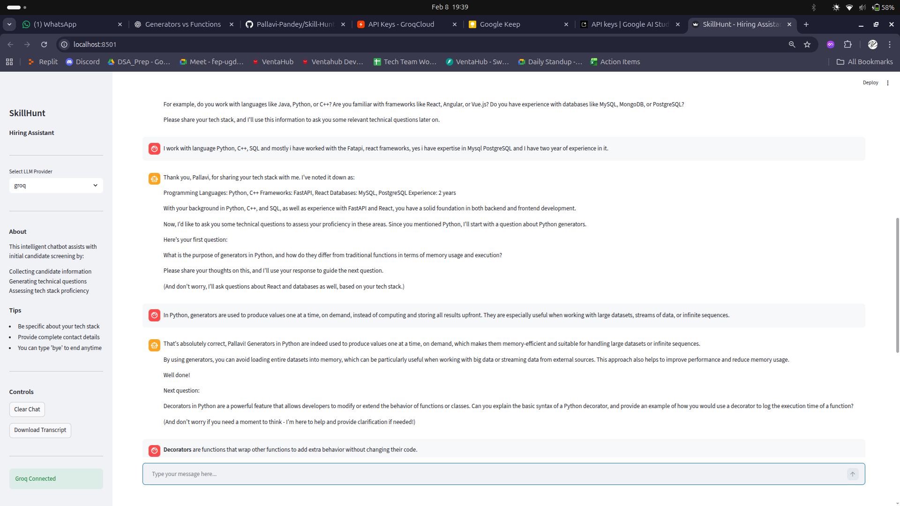
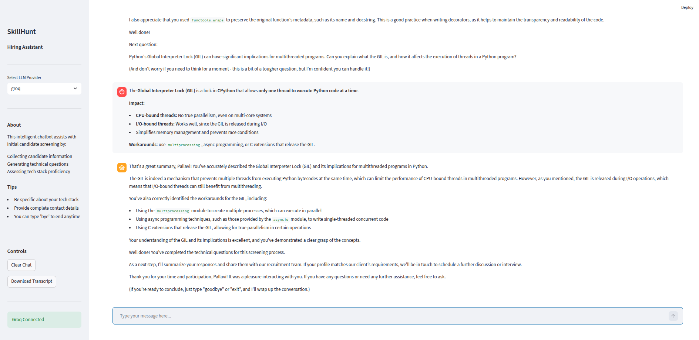

# SkillHunt - Intelligent Hiring Assistant

An AI-powered recruitment companion that automates initial candidate screening for technology positions. Built with Streamlit and powered by advanced LLMs (Gemini & Groq), SkillHunt helps recruitment teams gather candidate info, assess technical proficiency, and generate insightful summaries.


---

## Core Features

- **Interactive Chat Interface**: Modern, Streamlit-based UI for seamless candidate engagement.
- **Multi-LLM Support**: Integrated with **Google Gemini 2.0 Flash** and **Groq (Llama 3.3 70B)** for high-performance reasoning.
- **Intelligent Tech Stack Steering**: Automatically detects technologies mentioned (Python, Django, React, etc.) and steers the conversation toward specific technical concepts.
- **Adaptive Questioning**: Generates 3-5 technical questions tailored to the candidate's specific experience level (Junior, Mid-level, Senior).
- **Real-time Evaluation**: Provides instant constructive feedback on technical responses.
- **Interview Persistence**: Automatically saves interview transcripts in structured JSON format for easy ATS integration.
- **Transcript Downloads**: Allows candidates or recruiters to download the interview session immediately.

---

## Screenshots

<div align="center">
  
  
  <p><em>SkillHunt Chat Interface and Features</em></p>
</div>

---

## Technology Stack

- **Frontend**: [Streamlit](https://streamlit.io/)
- **LLM Providers**: [Google Gemini](https://ai.google.dev/), [Groq](https://groq.com/)
- **Core Library**: [google-genai](https://pypi.org/project/google-genai/), [groq](https://pypi.org/project/groq/)
- **Environment**: Python 3.8+, `python-dotenv`

---

## Quick Start

### 1. Installation

```bash
# Clone the repository
git clone https://github.com/Pallavi-Pandey/Skill-Hunt.git
cd Skill-Hunt

# Install dependencies
pip install -r requirements.txt
```

### 2. Configuration

Create a `.env` file from the template:

```bash
cp .env.example .env
```

Add your API keys to `.env`:

```env
GEMINI_API_KEY=your_gemini_api_key
GROQ_API_KEY=your_groq_api_key
```

### 3. Run the Application

```bash
streamlit run app.py
```

---

## Project Structure

```text
Skill-Hunt/
├── app.py              # Main Streamlit application & UI logic
├── llm_service.py      # LLM abstraction layer (Gemini/Groq)
├── config.py           # Centralized configuration & tech stacks
├── utils.py            # Helper functions (save, exit, steering)
├── requirements.txt    # Project dependencies
├── .env.example        # Environment template
└── interviews/         # Saved interview transcripts (JSON)
```

---

## Customization

You can easily customize the screening process in `config.py`:

- **Question Count**: Adjust `MIN_QUESTIONS_PER_STACK` and `MAX_QUESTIONS_PER_STACK`.
- **Supported Tech**: Add new categories or technologies to the `TECH_STACKS` dictionary.
- **Experience Levels**: Modify the `DIFFICULTY_LEVELS` list.

---

## Troubleshooting

### API Connection Issues
- **Gemini Key Missing**: Ensure `GEMINI_API_KEY` is set in `.env`.
- **Groq Key Missing**: Ensure `GROQ_API_KEY` is set in `.env`.
- The application will show a warning in the sidebar if keys are not detected.

### Dependency Errors
- If you see `ModuleNotFoundError`, run `pip install -r requirements.txt`.
- Ensure you are using Python 3.8+.

### Port Conflicts
- By default, Streamlit runs on port 8501. If it's occupied, use:
  ```bash
  streamlit run app.py --server.port 8502
  ```

---

## License

This project is created for educational purposes. Feel free to use and extend!

## Author

**Pallavi Pandey** - [GitHub](https://github.com/Pallavi-Pandey)

---
<p align="center">Made for more efficient hiring</p>

